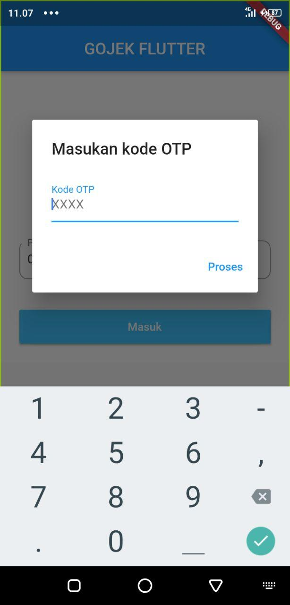
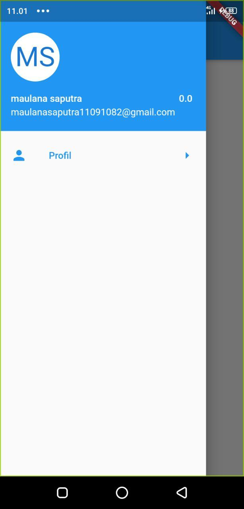

## <center>Un-Official Gojek API Wrapper for Flutter</center>
Repository berikut ini merupakan porting dari Gojek untuk Flutter

| Method  | Result  |
|---|---|
| `loginPhone`  | Ok |
| `loginGojek`  | Ok |
| `checkBalance`  | Ok |
| `checkWalletCode`  | In Progress |
| `transferGopay`  | In Progress |

### Ambil paket

```js
flutter pub get
```

### Jalankan pada folder example

```js
flutter run
```

### Dokumentasi
```js
import 'package:gojek_flutter/gojek_flutter.dart';

GojekFlutter gojek = new GojekFlutter();
```

#### Login GOJEK
##### Langkah Pertama
```js
final loginToken = (await gojek.loginPhone('<mobilePhone>'))['loginToken'];
```
##### Langkah Kedua
```js
final authToken = (await gojek.loginGojek(loginToken, '<OTP>'))['authToken'];
```

### Mendapatkan Balance
```js
ovoid.authToken = authToken;
final response = await gojek.checkBalance();
```

### Transfer GOPAY
#### Mendapatkan Check Wallet Code
```js
ovoid.authToken = authToken;
final QRID = (await gojek.checkWalletCode('<mobilePhoneTo>'))['QRID'];
```

#### Kirim Uang
```js
ovoid.authToken = authToken;
final response = await gojek.transferGopay(QRID, PIN, '<amount>', '<description>');
```

#### Contoh
##### login
- masukan nomor handphone
- dialog OTP

[](./../../)
##### menu utama
[](./../../)

### Author

[Maulana Saputra](mailto:maulanasaputra11091082@gmail.com)
